# 문제1 : 출력하기 - alert

> alert창으로 다음과 같은 문자열을 출력하는 code를 입력하세요.

```javascript
<!DOCTYPE html>
<html lang="en">
  <head>
    <meta charset="UTF-8" />
    <meta name="viewport" content="width=device-width, initial-scale=1.0" />
    <title>1번</title>
  </head>
  <body>
    <script>
      alert("javascript");
    </script>
  </body>
</html>
```

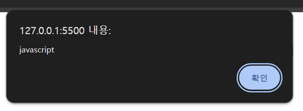

# 문제2 : 출력하기 - 문자열연결 연산자

> str1과 str2를 연결하여 alert로 “hI ECMA Script”문자열을 출력하시오.

```javascript
<!DOCTYPE html>
<html lang="en">
  <head>
    <meta charset="UTF-8" />
    <meta name="viewport" content="width=device-width, initial-scale=1.0" />
    <title>2번</title>
  </head>
  <body>
    <script>
      let str1 = "Hi";
      let str2 = "ECMA Script";

      document.write(str1 + " " + str2);
    </script>
  </body>
</html>
```

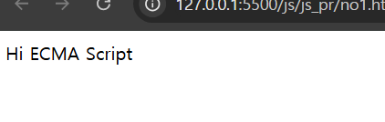

# 문제3 : 출력하기 - 콘솔창

```javascript
<!DOCTYPE html>
<html lang="en">
  <head>
    <meta charset="UTF-8" />
    <meta name="viewport" content="width=device-width, initial-scale=1.0" />
    <title>2번</title>
  </head>
  <body>
    <script>
      console.log("자바스크립트!");
    </script>
  </body>
</html>
```

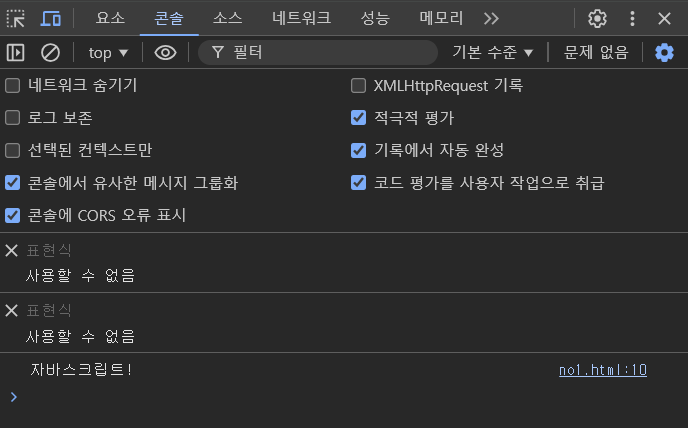

# 문제4 : 출력하기 - document.write()

document.write문으로 테이블(table) 태그를 출력하시오.

```javascript
<!DOCTYPE html>
<html lang="en">
  <head>
    <meta charset="UTF-8" />
    <meta name="viewport" content="width=device-width, initial-scale=1.0" />
    <title>2번</title>
  </head>
  <body>
    <script>
      document.write("<table border = '1px'>");
      document.write("<tr>");
      document.write("<th>학번</th>");
      document.write("<th>이름</th>");
      document.write("<th>국어점수</th>");
      document.write("</tr>");
      document.write("<tr>");
      document.write("<td>010</td>");
      document.write("<td>길동</td>");
      document.write("<td>80</td>");
      document.write("</tr>");
      document.write("</table>");
    </script>
  </body>
</html>
```

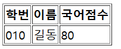

# 문제5 : 입력받기 - prompt()

신학기가 시작되고, 아이들이 돌아가면서 자기소개를 하기로 했습니다.

만약 입력으로 `김다정`이라는 이름이 주어지면 "안녕하세요. 저는 김다정입니다."라고 출력하게
해주세요.

```javascript
<!DOCTYPE html>
<html lang="en">
  <head>
    <meta charset="UTF-8" />
    <meta name="viewport" content="width=device-width, initial-scale=1.0" />
    <title>5번</title>
  </head>
  <body>
    <script>
      let name = prompt("이름을 입력하세요.");
      document.write("안녕하세요 저는 " + name + "입니다.");
    </script>
  </body>
</html>
```

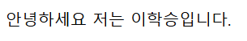

# 문제6 : 입력받기 - number형으로 계산

prompt로 수학 점수를 입력받아 콘솔로 출력하시오.

```javascript
<!DOCTYPE html>
<html lang="en">
  <head>
    <meta charset="UTF-8" />
    <meta name="viewport" content="width=device-width, initial-scale=1.0" />
    <title>6번</title>
  </head>
  <body>
    <script>
      let score = prompt("점수를 입력하세요");
      console.log("당신의 수학 점수는" + score + "점 입니다.");
    </script>
  </body>
</html>
```

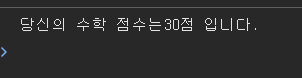

# 문제7 : 함수형변수 선언하기

정수 3개를 입력받아, 총합을 반환하는 함수형 변수(익명함수)를 선언하고 실행하여 다음을 출력하시오

```javascript
<!DOCTYPE html>
<html lang="en">
  <head>
    <meta charset="UTF-8" />
    <meta name="viewport" content="width=device-width, initial-scale=1.0" />
    <title>7번</title>
  </head>
  <body>
    <script>
      let num = (a, b, c) => {
        return a + b + c;
      };
      let input = prompt("3개를 입력하세요.");

      let [a, b, c] = input.split(" ").map(Number);

      document.write(num(a, b, c));
    </script>
  </body>
</html>
```

# 문제8 : 마우스이벤트 사용하기

마우스 오버/아웃 이벤트를 이용하여, img태그의 이미지가 바뀌도록 하시오.

???로 된 부분을 채워 넣으세요.

```html

```

# 문제9 : 데이터타입 종류

자바스크립트의 데이터 타입에 대해서 공백을 채우시오.

1. 숫자를 담는 데이터 타입 : ( number )
2. 문자열을 담는 데이터 타입:( string )
3. 논리값을 담는 데이터 타입:( boolean )
4. 선언 또는 초기화 되지 않는 데이터의 타입: ( undefined)
5. 객체타입(배열 또는 key-value객체):( object )
6. 함수타입:( function )

# 문제10 : 연산자 - Number() String()

prompt함수를 이용하여 사용자로부터 문자열(아라비아숫자)을 입력받는다.
그 수에 2를 곱한 값을 출력하시오.

```javascript
<!DOCTYPE html>
<html lang="en">
  <head>
    <meta charset="UTF-8" />
    <meta name="viewport" content="width=device-width, initial-scale=1.0" />
    <title>10번</title>
  </head>
  <body>
    <script>
      let input = prompt("정수를 입력하세요.");
      input = parseInt(input);
      document.write(input * 2);
    </script>
  </body>
</html>
```

# 문제11 : 자릿수 구하기 - 연산자

prompt로 입력받은 숫자의 백의 자릿수,십의 자릿수와 일의 자릿수를 출력하시오.  
예) "123" => 백의 자릿수 1, 십의 자릿수 2, 일의 자릿수 3

```javascript
<!DOCTYPE html>
<html lang="en">
  <head>
    <meta charset="UTF-8" />
    <meta name="viewport" content="width=device-width, initial-scale=1.0" />
    <title>11번</title>
  </head>
  <body>
    <script>
      let num = prompt("정수를 입력하세요.");
      num = Number(num);

      let st = num / 100;
      st = parseInt(st);
      let nd = (num - st * 100) / 10;
      nd = parseInt(nd);
      let rd = num - st * 100 - nd * 10;
      rd = parseInt(rd);

      console.log("백의 자릿수 : " + st);
      console.log("십의 자릿수 : " + nd);
      console.log("일의 자릿수 : " + rd);
    </script>
  </body>
</html>
```

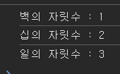

# 문제12 : 평균 점수

영하네 반은 국어, 수학, 영어 시험을 보았습니다. 영하는 친구들의 평균 점수를 구해주기로 했습니다.

공백으로 구분하여 세 과목의 점수가 주어지면 **전체 평균 점수**를 구하는 프로그램을 작성하세요.
**단, 소숫점 자리는 모두 버립니다.**

```javascript
<!DOCTYPE html>
<html lang="en">
  <head>
    <meta charset="UTF-8" />
    <meta name="viewport" content="width=device-width, initial-scale=1.0" />
    <title>12번</title>
  </head>
  <body>
    <script>
      let num = prompt("세 과목의 점수를 입력하세요.").split(" ");
      let sum = 0;
      sum = parseInt(sum);
      for (i = 0; i < 3; i++) {
        sum += parseInt(num[i], 10);
      }
      avg = sum / 3;
      avg = parseInt(avg);

      console.log(sum / 3);
    </script>
  </body>
</html>
```

# 문제13 : 몫과 나머지

공백으로 구분하여 두 숫자가 주어집니다.  
두번째 숫자로 첫번째 숫자를 나누었을 때 **그 몫과 나머지를 공백으로 구분하여 출력하세요.**

```javascript
<!DOCTYPE html>
<html lang="en">
  <head>
    <meta charset="UTF-8" />
    <meta name="viewport" content="width=device-width, initial-scale=1.0" />
    <title>12번</title>
  </head>
  <body>
    <script>
      let num = prompt("정수 두개를 입력하세요.").split(" ");

      share = num[0] / num[1];
      share = parseInt(share);
      rest = num[0] % num[1];

      console.log(share + " " + rest);
    </script>
  </body>
</html>
```

# 문제14 : 제곱을 구하자 - Math.pow()

공백으로 구분하여 두 숫자 a와 b가 주어지면, **a의 b승**을 구하는 프로그램을 작성하세요.

```javascript
<!DOCTYPE html>
<html lang="en">
  <head>
    <meta charset="UTF-8" />
    <meta name="viewport" content="width=device-width, initial-scale=1.0" />
    <title>14번</title>
  </head>
  <body>
    <script>
      let num = prompt("정수 두개를 입력하세요.").split(" ");

      let bot = num[0];
      let tp = num[1];

      let result = Math.pow(bot, tp);
      console.log(result);
    </script>
  </body>
</html>
```

# 문제15 : 원의 넓이를 구하세요

원의 넓이는 `반지름의 길이 x 반지름의 길이 x 3.14`로 구할 수 있습니다.
함수를 사용하여 원의 넓이를 구하는 코드를 작성해봅시다.

**입력으로 반지름의 길이 정수 n이 주어지면 원의 넓이를 반환하는 함수**를 만들어 주세요.

```javascript
<!DOCTYPE html>
<html lang="en">
  <head>
    <meta charset="UTF-8" />
    <meta name="viewport" content="width=device-width, initial-scale=1.0" />
    <title>15번</title>
  </head>
  <body>
    <script>
      let r = prompt("반지름의 길이를 입력하세요.");
      let circle = r * r * 3.14;

      console.log(circle);
    </script>
  </body>
</html>
```

# 문제16 : 숫자비교1 - 비교연산자

다음 로직의 결과를 true/false로 출력하시오.

```javascript
입력;
//20은 30보다 작은지 true/false로 출력하시오.
//20은 30보다 같거나 작은지 true/false로 출력하시오.

출력;
false;
true;
```

```javascript
console.log(20 < 30);
console.log(20 <= 30);
```

# 문제17 : 숫자비교2 - 논리연산자

다음 로직의 결과를 true/false로 출력하시오.

```javascript
입력;
//1) 10은 20보다 작으면서(~이고), 10은 5보다 큰가?
//2) 123의 일의 자릿수는 3인가?
//3) 5는 1보다 크거나 10보다 작은가?

출력;
true;
true;
true;
```

```javascript
console.log(20 < 30 && 10 > 5);
console.log(123 % 10 == 3);
console.log(5 > 1 || 5 < 10);
```

# 문제18 : 3의 배수 인가요? if문

영희는 친구와 게임을 하고 있습니다.  
서로 돌아가며 랜덤으로 숫자를 하나 말하고 그게 3의 배수이면 박수를 치고 아니면 그 숫자를 그대로 말하는 게임입니다.

입력으로 랜덤한 숫자 n이 주어집니다.

만약 그 수가 **3의 배수라면 '짝'이라는 글자를, 3의 배수가 아니라면 n을 그대로 출력**해 주세요.

```javascript
<!DOCTYPE html>
<html lang="en">
  <head>
    <meta charset="UTF-8" />
    <meta name="viewport" content="width=device-width, initial-scale=1.0" />
    <title>18번</title>
  </head>
  <body>
    <script>
      let n = prompt("정수를 입력해주세요");
      if (n % 3 == 0) {
        console.log("짝");
      } else {
        console.log(n);
      }
    </script>
  </body>
</html>
```

# 문제19 : 몇 번째 행성인가요? if문

우리 태양계를 이루고 있는 행성은 **수성, 금성, 지구, 화성, 목성, 토성, 천왕성, 해왕성**으로 총 8개 입니다.  
저희는 우리 태양계의 n번째 행성이 무엇인지 알고 싶습니다.

입력으로 행성의 순서를 나타내는 숫자 n이 입력됩니다.
출력으로 그 순서에 해당하는 행성의 이름을 출력해 주세요.

예를들어 1이 입력되면, 첫번째 행성인 수성이 출력됩니다.

```javascript
<!DOCTYPE html>
<html lang="en">
  <head>
    <meta charset="UTF-8" />
    <meta name="viewport" content="width=device-width, initial-scale=1.0" />
    <title>19번</title>
  </head>
  <body>
    <script>
      let solar = [
        "수성",
        "금성",
        "지구",
        "화성",
        "목성",
        "토성",
        "천왕성",
        "해왕성",
      ];
      let n = prompt("정수를 입력해주세요");
      if (n > 1 && n < 9) {
        console.log(solar[n - 1]);
      } else {
        let n = prompt("1~8까지의 숫자를 입력해주세요");
      }
    </script>
  </body>
</html>
```

# 문제20 : 놀이기구 키 제한 - if문

유주는 놀이공원 아르바이트 중입니다.  
 그런데 놀이기구마다 키 제한이 있습니다.
유주가 담당하는 놀이기구는 키가 150cm 이상만 탈 수 있습니다.

입력으로 키가 주어지면
키가 150이 넘으면 **YES**를 틀리면 **NO**를 출력하는 프로그램을 작성하세요.

```javascript
<!DOCTYPE html>
<html lang="en">
  <head>
    <meta charset="UTF-8" />
    <meta name="viewport" content="width=device-width, initial-scale=1.0" />
    <title>20번</title>
  </head>
  <body>
    <script>
      let h = prompt("키를 입력해주세요");

      if (h < 150) {
        console.log("NO");
      } else {
        console.log("YES");
      }
    </script>
  </body>
</html>
```

# 문제21 : 배수인지 확인하기

다음 중 변수 i가 6의 배수인지 확인하는 방법으로 올바른 것은?

1.  i / 6 == 0
2.  i % 6 == 0 ⭕
3.  i & 6 == 0
4.  i | 6 == 0
5.  i // 6 == 0

# 문제22 : OX문제

`console.log(10/3)`의 출력 결과는 **3**이다.

❌

# 문제23 : 대문자로 바꿔주세요! - 문자열함수

민지는 국제 포럼에서 아르바이트를 하게 되었습니다.  
민지는 각 국에서 온 참가자들의 명단을 엑셀로 정리하고 있는데 참가자들 이름이 어떤 이는 전부 소문자,  
어떤 이는 전부 대문자로 써져 있는 등 형식이 제각각이었습니다.

민지를 위해 **이름이 입력되면 전부 대문자로 출력되는 프로그램**을 만들어주세요.

```javascript
<!DOCTYPE html>
<html lang="en">
  <head>
    <meta charset="UTF-8" />
    <meta name="viewport" content="width=device-width, initial-scale=1.0" />
    <title>23번</title>
  </head>
  <body>
    <script>
      let name = prompt("이름을 입력해주세요");

      for (let i = 0; i < name.length; i++) {
        name = name.replace(name[i], name[i].toUpperCase());
      }
      console.log(name);
    </script>
  </body>
</html>
```

# 문제24 : 행성 문제2 - if문 배열

우리 태양계를 이루는 행성은 수성, 금성, 지구, 화성, 목성, 토성, 천왕성, 해왕성이 있습니다.  
이 행성들의 영어 이름은 Mercury, Venus, Earth, Mars, Jupiter, Saturn, Uranus, Neptune입니다.

**행성의 한글 이름을 입력하면 영어 이름을 반환하는 프로그램**을 만들어 주세요.

```javascript
<!DOCTYPE html>
<html lang="en">
  <head>
    <meta charset="UTF-8" />
    <meta name="viewport" content="width=device-width, initial-scale=1.0" />
    <title>24번</title>
    <script>
      let planets = {
        수성: "Mercury",
        금성: "Venus",
        지구: "Earth",
        화성: "Mars",
        목성: "Jupiter",
        토성: "Saturn",
        천왕성: "Uranus",
        해왕성: "Neptune",
      };

      let name = prompt("행성의 이름을 입력하세요.");

      if (planets[name]) {
        document.write(planets[name]);
      } else {
        document.write("태양계 행성이 아닙니다.");
      }
    </script>
  </head>
  <body></body>
</html>
```

# 문제25 : 객체 만들기

첫번째 입력에서는 학생의 이름이 공백으로 구분되어 입력되고, 두번째에는 그 학생의 수학 점수가 공백으로 구분되어 주어집니다.

두 개를 합쳐 **학생의 이름이 key**이고 **value가 수학 점수**인 객체를 출력해주세요.

```javascript
<!DOCTYPE html>
<html lang="en">
  <head>
    <meta charset="UTF-8" />
    <meta name="viewport" content="width=device-width, initial-scale=1.0" />
    <title>25번</title>
    <script>
      let name = prompt("학생의 이름을 공백으로 구분하여 입력하세요.").split(
        " "
      );

      let scores = prompt(
        "학생의 수학 점수를 공백으로 구분하여 입력하세요."
      ).split(" ");

      let studentScores = {};

      for (let i = 0; i < name.length; i++) {
        studentScores[name[i]] = parseInt(scores[i], 10);
      }

      console.log(studentScores);
      for (let i = 0; i < name.length; i++) {
        document.write(
          "이름 : " + name[i] + "/ 점수 : " + studentScores[name[i]] + "<br>"
        );
      }
    </script>
  </head>
  <body></body>
</html>
```

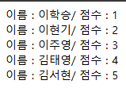

# 문제26 : 2-gram

2-gram이란 문자열에서 2개의 연속된 요소를 출력하는 방법입니다.  
예를 들어 'Javascript'를 2-gram으로 반복해 본다면 다음과 같은 결과가 나옵니다.  
입력으로 문자열이 주어지면 2-gram으로 출력하는 프로그램을 작성해 주세요.

```
입력
Javascript

출력
J a
a v
v a
a s
s c
c r
r i
i p
p t
```

- 힌트: 문자열변수[0]은 첫번째 문자를 의미합니다.

```javascript
<!DOCTYPE html>
<html lang="en">
  <head>
    <meta charset="UTF-8" />
    <meta name="viewport" content="width=device-width, initial-scale=1.0" />
    <title>25번</title>
    <script>
      let text = prompt("문자를 입력하세요.");

      for (let i = 0; i < text.length; i += 2) {
        console.log(text[i], text[i + 1]);
      }
    </script>
  </head>
  <body></body>
</html>
```

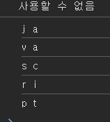

# 문제27 : 대문자만 지나가세요

진구는 영어 학원 아르바이트를 하고 있습니다. 반 아이들은 알파벳을 공부하는 학생들인데 오늘은 대문자 쓰기 시험을 봤습니다.

**알파벳 하나만을 입력하고 그 알파벳이 대문자이면 YES를 아니면 NO를 출력하는 프로그램**을 만들어 주세요.

```javascript
<!DOCTYPE html>
<html lang="en">
  <head>
    <meta charset="UTF-8" />
    <meta name="viewport" content="width=device-width, initial-scale=1.0" />
    <title>27번</title>
    <script>
      let text = prompt("알파벳을 입력하세요");

      if (text == text.toUpperCase()) {
        console.log("true");
      } else {
        console.log("false");
      }
    </script>
  </head>
  <body></body>
</html>
```

# 문제28 : 문자열 속 문자 찾기

문자 pineapple에는 apple이라는 문자가 숨어 있습니다. 원범이는 이렇듯 문자열 속에 숨어있는 문자를 찾아보려고 합니다.

첫번째 입력에서는 문자열이 입력되고, 두번째에는 찾을 문자가 입력되어야 합니다.
**그 문자가 시작하는 index를 반환하는 프로그램**을 만들어 주세요

```jsx
**입력**
pineapple is yummy
apple

**출력**
4
```

힌트: indexOf()함수를 이용합니다.

```javascript
<!DOCTYPE html>
<html lang="en">
  <head>
    <meta charset="UTF-8" />
    <meta name="viewport" content="width=device-width, initial-scale=1.0" />
    <title>28번</title>
    <script>
      let text = prompt("pine apple is mine.");
      let find = prompt("apple");

      console.log(text.indexOf(find));
    </script>
  </head>
  <body></body>
</html>
```

# 문제29 : 자바스크립트 자료형의 복잡도

다음 배열 내장함수의 시간 복잡도가 O(1)이 아닌 것을 모두 고르시오.

1.  arr[i] // O(1)
2.  arr.push(5) // O(1)
3.  arr.slice() // O(n)
4.  arr.pop() // O(1)
5.  arr.includes(5) // O(n)

# 문제30 : 문자열 만들기

취업 준비생인 혜림이는 자기소개서를 쓰고 있습니다. 열심히 자기소개서를 작성하던 도중 혜림이는 자기가 지금까지 단어를 얼마나 적었는지 궁금하게 됩니다.

혜림이를 위해 **문자열을 입력받으면 단어의 갯수를 출력하는 프로그램**을 작성해 주세요.

```javascript
<!DOCTYPE html>
<html lang="en">
  <head>
    <meta charset="UTF-8" />
    <meta name="viewport" content="width=device-width, initial-scale=1.0" />
    <title>30번</title>
    <script>
      let text = prompt("입력하세요");

      console.log(text.length);
    </script>
  </head>
  <body></body>
</html>
```

# 문제31 : 거꾸로 출력하기

한 줄에 여러개의 숫자가 입력되면, 역순으로 그 숫자들을 하나씩 출력하는 프로그램을 작성하시오.

```javascript
<!DOCTYPE html>
<html lang="en">
  <head>
    <meta charset="UTF-8" />
    <meta name="viewport" content="width=device-width, initial-scale=1.0" />
    <title>31번</title>
    <script>
      let input = prompt("숫자를 입력하세요.");
      let reversed = input.split("").reverse().join("");
      document.write(reversed);
      console.log(reversed);
    </script>
  </head>
  <body></body>
</html>
```

# 문제32 : sort 구현하기

민주는 체육부장으로 체육시간이 되면 반 친구들이 제대로 키 순서대로 모였는지를 확인해야 한다.  
 그런데 요즘 민주는 그것이 너무 번거롭게 느껴져 한 번에 확인하고 싶어한다.

민주를 위해 **키가 주어지면 순서대로 제대로 섰는지 확인하는 프로그램**을 작성해보자.  
(키는 공백으로 구분하여 입력됩니다.)

```javascript
<!DOCTYPE html>
<html lang="en">
  <head>
    <meta charset="UTF-8" />
    <meta name="viewport" content="width=device-width, initial-scale=1.0" />
    <title>32번</title>
    <script>
      let input = prompt("키를 입력하세요.").split(" ");

      for (i = 0; i < input.length; i++) {
        if (input[i] > input[i + 1]) {
          document.write("X");
          break;
        }
        document.write("O");
        break;
      }
    </script>
  </head>
  <body></body>
</html>
```

# 문제33 : Factory 함수 사용하기

2제곱, 3제곱, 4제곱을 할 수 있는 Factory 함수를 만들려고 합니다.

/_빈칸_/에 코드를 작성하여 two함수를 완성하세요.

```javascript
function one(n) {
  function two(value) {
    const sq = Math.pow(value, n);
    return sq;
  }
  return two;
}

const a = one(2);
const b = one(3);
const c = one(4);

console.log(a(10));
console.log(b(10));
console.log(c(10));
```

# 문제34 : 구구단 출력하기

1~9까지의 숫자 중 하나를 입력하면 그 단의 구구단 결과를 한 줄에 출력하는 프로그램을 작성하세요.

```javascript
<!DOCTYPE html>
<html lang="en">
  <head>
    <meta charset="UTF-8" />
    <meta name="viewport" content="width=device-width, initial-scale=1.0" />
    <title>34번</title>
    <script>
      let num = prompt("1~9 사이의 숫자 하나를 입력하세요.");
      num = parseInt(num);
      if (num >= 1 && num <= 9) {
        for (let i = 1; i <= 9; i++) {
          document.write(num + " 곱하기 " + i + " = " + num * i + "<br>");
        }
      } else {
        alert("잘못된 숫자입니다.");
      }
    </script>
  </head>
  <body></body>
</html>
```

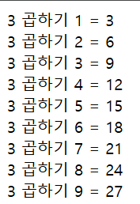

# 문제35 : 반장 선거

새 학기를 맞아 호준이네 반은 반장 선거를 하기로 했습니다. <br> 그런데 표를 하나씩 개표하는 과정이 너무 번거롭게 느껴진 당신은 <br>**학생들이 뽑은 후보들을 입력받으면 뽑힌 학생의 이름과 받은 표 수를 출력하는 프로그램**을 작성하기로 하였습니다.

```javascript
<!DOCTYPE html>
<html lang="en">
  <head>
    <meta charset="UTF-8" />
    <meta name="viewport" content="width=device-width, initial-scale=1.0" />
    <title>35번</title>
    <script>
      window.onload = function () {
        let a = 0,
          b = 0,
          c = 0;
        while (true) {
          let num = prompt(
            "기호 1번, 2번, 3번 숫자만 입력하세요. (종료하려면 0 입력)"
          );
          if (num === null || num.trim() === "") {
            alert("입력이 취소되었거나 잘못되었습니다.");
            continue;
          }
          num = parseInt(num);
          if (isNaN(num)) {
            alert("숫자를 입력하세요.");
            continue;
          }
          switch (num) {
            case 1:
              a++;
              break;
            case 2:
              b++;
              break;
            case 3:
              c++;
              break;
            case 0:
              document.write("투표 종료 <br>");
              document.write("기호 1번: " + a + " 표 획득<br>");
              document.write("기호 2번: " + b + " 표 획득<br>");
              document.write("기호 3번: " + c + " 표 획득<br>");
              return;
            default:
              alert("잘못된 번호입니다.");
              break;
          }
        }
      };
    </script>
  </head>
  <body></body>
</html>
```

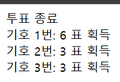

# 문제36 : 호준이의 아르바이트

호준이는 아르바이트로 영어 학원에서 단어 시험지를 채점하는 일을 하고 있다.  
 호준이가 일하는 학원은 매번 1위부터 3위까지의 학생에게 상으로 사탕을 준다.  
 그런데 오늘은 마침 사탕이 다 떨어져서 호준이가 채점을 하고 점수를 보내면, 당신이 아이들의 숫자만큼 사탕을 사러 가기로 했다.

1위 ~ 3위 학생은 여러명일 수 있고 1~3위 학생 중 중복되는 학생까지 포함하여 사탕을 사기로 한다.  
**학생들의 점수를 공백으로 구분하여 입력을 받고 사탕을 받을 학생의 수를 출력하세요.**

```javascript
<!DOCTYPE html>
<html lang="en">
  <head>
    <meta charset="UTF-8" />
    <meta name="viewport" content="width=device-width, initial-scale=1.0" />
    <title>36번</title>
    <script>
      const score = prompt("공백으로 구분하여 점수를 입력하시오").split(" ");
      for (let i = 0; i < score.length; i++) {
        document.write(score[i] + "점 / ");
      }
      let st = 0;
      let stn = 1;
      let nd = 0;
      let ndn = 1;
      let rd = 0;
      let rdn = 1;
      for (i = 0; i < score.length; i++) {
        if (st <= score[i]) {
          st = score[i];
          if (st == score[i + 1]) {
            stn++;
          }
        }
      }

      for (i = 0; i < score.length; i++) {
        if (score[i] < st && score[i] >= nd) {
          nd = score[i];
          if (nd == score[i + 1]) {
            ndn++;
          }
        }
      }

      for (i = 0; i < score.length; i++) {
        if (score[i] < nd && score[i] >= rd) {
          rd = score[i];
          if (rd == score[i + 1]) {
            rdn++;
          }
        }
      }

      // 결과 출력
      document.write("<br>1등: " + st + "점 " + stn + "명<br>");
      document.write("2등: " + nd + "점 " + ndn + "명<br>");
      document.write("3등: " + rd + "점 " + rdn + "명<br>");
    </script>
  </head>
  <body></body>
</html>
```

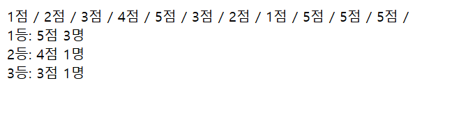

# 문제37 : 오타 수정하기

혜원이는 평소 영타가 빠르고 정확한 것을 친구들에게 자랑하고 다녔습니다.  
반 친구들이 혜원이의 타자 속도가 빠르다는 것을 모두 알게 되자 혜원이는 모두의 앞에서 타자 실력을 보여주게 됩니다.

그런데 막상 보여주려니 긴장이 되서 문장의 모든 e를 q로 잘못 친 것을 발견했습니다.  
혜원이는 프로그램을 돌려 재빠르게 모든 q를 e로 바꾸는 프로그램을 작성하려고 합니다.

**문장이 입력되면 모든 q를 e로 바꾸는 프로그램을 작성해 주세요.**

```javascript
<!DOCTYPE html>
<html lang="en">
  <head>
    <meta charset="UTF-8" />
    <meta name="viewport" content="width=device-width, initial-scale=1.0" />
    <title>37번</title>
    <script>
      const input = prompt("문장을 입력하세요.");

      if (input !== null) {
        const result = input.replace(/q/g, "e");

        alert("결과: " + result);
      } else {
        alert("입력이 취소되었습니다.");
      }
    </script>
  </head>
  <body></body>
</html>
```
